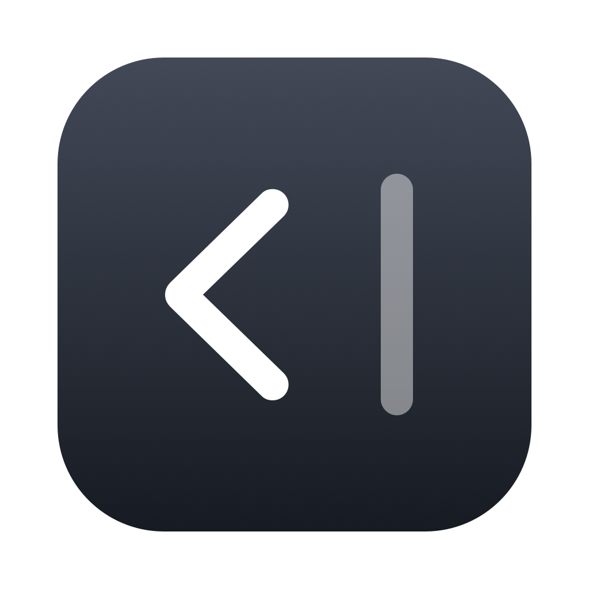

<p align="center">
  
</p>

<h1 align="center">TuckBar</h1>

<p align="center">
  A lightweight, native menu bar organizer for macOS.
</p>

<p align="center">
  <a href="https://github.com/laurenschristian/tuckbar/releases/latest"></a>
  
  
  <a href="LICENSE"></a>
</p>

## Overview

TuckBar hides menu bar icons you do not need to see all the time. Click one control to show or hide them.

TuckBar is built for low, stable resource use. It is two small AppKit source files with no dependencies, timers, polling, or network access. It draws its icons once at launch. After that, it only checks the pointer position when the mouse moves.

## Performance

Measured on macOS 26, Apple Silicon:

| Metric | TuckBar 1.1.0 |
| --- | --- |
| Memory footprint | 25 MB, stable over time |
| Idle CPU | 0% |
| App bundle size | 420 KB |
| Download size | 252 KB |

## Features

- Show or hide menu bar icons with one click, or by hovering over the chevron or a folder
- Customizable global hotkey (default ⌃⌥⌘T), plus Shift to show everything
- Optional always-hidden section for icons you almost never need
- Folders: group icons such as Stats or utilities behind one folder icon
- Optional auto-hide 10 seconds after you expand
- Launch at login
- Positions persist across restarts
- Universal binary for Apple Silicon and Intel
- No analytics, no network access, no settings window

## Requirements

- macOS 13 Ventura or later

## Installation

### Homebrew (recommended)

```sh
brew install --cask laurenschristian/tap/tuckbar
xattr -dr com.apple.quarantine /Applications/TuckBar.app
```

### Manual download

1. Download the latest `TuckBar-vX.Y.Z.dmg` from [Releases](https://github.com/laurenschristian/tuckbar/releases/latest).
2. Open the disk image and drag TuckBar to Applications.
3. Run `xattr -dr com.apple.quarantine /Applications/TuckBar.app`.

> [!NOTE]
> TuckBar is not notarized by Apple yet, so Gatekeeper blocks the first launch. The `xattr` command removes the download quarantine flag. You can also approve the app in System Settings > Privacy & Security > Open Anyway.

## Usage

1. Launch TuckBar. A chevron and a `|` separator appear in the menu bar.
2. Hold Cmd and drag the icons you want to hide to the left of the separator.
3. Click the chevron, or press ⌃⌥⌘T, to show or hide those icons.
4. Right-click or Control-click the chevron to open the menu.

| Action | Result |
| --- | --- |
| Click the chevron, or ⌃⌥⌘T | Show or hide the hidden section |
| Option-click the chevron, or ⌃⌥⌘⇧T | Show everything, including the always-hidden section |
| Right-click or Control-click the chevron | Open the menu |

| Menu item | Description |
| --- | --- |
| Show on Hover | Shows hidden icons while the pointer is over the chevron or a folder. They hide when the pointer leaves the menu bar and no menu is open |
| Auto-hide after 10s | Hides the icons again 10 seconds after you expand them |
| Always-hidden section | Adds a second `‖` separator. Icons to its left stay hidden until you show everything |
| Hotkey Enabled | Turns the global hotkeys on or off |
| Set Hotkey… | Records a new shortcut. Show All uses the same shortcut plus Shift |
| New Folder… | Adds a folder icon to the menu bar. See [Folders](#folders) |
| Launch at Login | Starts TuckBar when you log in |
| Quit TuckBar | Quits the app |

### Always-hidden section

Turn on Always-hidden section in the menu. A `‖` separator appears to the left of the `|` separator. Hold Cmd and drag the icons you rarely need to the left of `‖`. A normal click does not show these icons. Option-click the chevron or press ⌃⌥⌘⇧T to show them. When you show everything, TuckBar hides it again after 10 seconds.

The order from left to right must be `‖`, then `|`, then the chevron. If a separator is out of order, TuckBar does not collapse it, so it cannot hide its own controls.

### Folders

A folder puts a group of menu bar icons behind one icon. For example, a chart icon for all your Stats items.

1. Right-click the chevron and choose New Folder…. Enter a name.
2. The folder icon appears right of the chevron. Click it.
3. Choose Grant Accessibility Access… the first time, and turn on TuckBar in System Settings.
4. Open Add or Remove and check the items for this folder.
5. Hold Cmd and drag those items left of the `|` separator, so they stay hidden.

Hover over the folder to show the hidden icons. Click the folder and choose an item to open that item's own menu. The icons hide again when the pointer leaves the menu bar and no menu is open. The folder menu also lets you change the icon, rename, or delete the folder.

Folders need Accessibility permission to open other apps' menu bar items. The rest of TuckBar works without it. TuckBar reads the item list only when you open a folder, and only for the apps in that folder.

## How it works

TuckBar adds a chevron and one or two separators to the menu bar. To hide icons, it expands a separator to 10,000 points wide. This pushes every item to its left off screen. To show them, it returns the separator to its normal width. The hotkeys use the Carbon hotkey API, so they need no Accessibility permission. Folders press the chosen item through the Accessibility API. macOS stores each item's position, so the layout persists across restarts.

## Building from source

Building requires the Xcode Command Line Tools (`xcode-select --install`).

```sh
git clone https://github.com/laurenschristian/tuckbar.git
cd tuckbar
./build.sh install
```

| Command | Result |
| --- | --- |
| `./build.sh` | Builds `build/TuckBar.app` (universal) |
| `./build.sh install` | Builds, installs to `/Applications`, and launches |
| `./build.sh release` | Builds `build/TuckBar-v<version>.dmg` and prints its SHA-256 |
| `swift scripts/make-icon.swift` | Regenerates `icon.png` and `Resources/AppIcon.icns` |

The version is set in `Info.plist`.

## Uninstalling

```sh
brew uninstall --zap --cask tuckbar
```

For a manual install, quit TuckBar, delete `/Applications/TuckBar.app`, and run `defaults delete com.laurenschristian.tuckbar`.

## License

TuckBar is released under the [MIT License](LICENSE).
